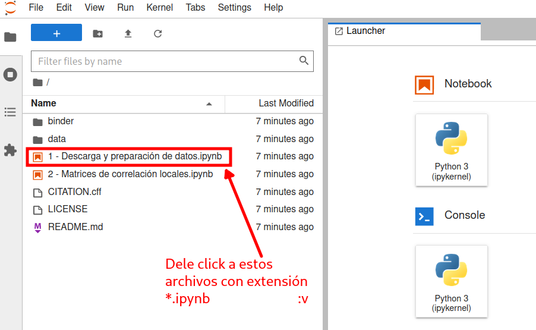

# Correlación de series de tiempo

[](https://mybinder.org/v2/gh/mijailo/timeSeriesCorrelations/HEAD)
> Inspirado en [este](http://mybinder.org/v2/gh/binder-examples/requirements/master) repositorio. 

Esta colección de _notebooks_ tiene la intención de ejemplificar de forma simple una tarea de descarga de series de tiempo financieras ([Yahoo Finance](https://finance.yahoo.com/)), preparación y limpieza de los datos, y cálculo de matrices de [correlación de Pearson](https://en.wikipedia.org/wiki/Pearson_correlation_coefficient).

## Contenido del repositorio

```sh
./
├── 1 - Descarga y preparación de datos.ipynb #La _carnita_ del repositorio está en los archivos `*.ipynb`
├── 2 - Matrices de correlación.ipynb
├── 3 - Análisis básico de series de tiempo.ipynb
├── binder #Estos archivos de acá son útiles para desplegar un ambiente virtual en la nube.
│   ├── requirements.in
│   ├── requirements.txt
│   └── runtime.txt
├── binderLoading.png #Esta imagen es utilizada por el README.md.
├── CITATION.cff
├── data # Acá están los datos utilizados o generados por los notebooks.
│   ├── ^MXX_from2008-09-15_to2022-05-17_downloaded20230517.json
│   ├── ^MXX_from2008-09-15_to2022-06-16_downloaded20220616.json
│   ├── rendimientos.csv
│   ├── returns^MXX_from2008-09-15_to2022-05-17_downloaded20230517.csv
│   ├── returns^MXX_from2008-09-15_to2022-06-16_downloaded20220616.csv
│   ├── returns_SP500.csv
│   ├── stockPrices_downloaded20230517.csv
│   └── worldIndices_20220616.json
├── jupyterReady.png # Esta imagen es utilizada por el README.md.
├── LICENSE
└── README.md # **Este** archivo.
```

## Utilización del repositorio

Para poder interactuar con los _notebooks_ (archivos con extensión `*.ipynb`), dele click al botón  de la parte superior izquierda de este `README.md`. De forma alternativa, puede utilizar [este enlace](https://mybinder.org/) y pegar en el primer cuadro de texto la URL de este repositorio.

> **Nota**: Puede tomar _un rato_ en desplegarse el ambiente de trabajo.
>
> 
>
> Una vez desplegado, podrá interactuar con el código de los _notebooks_.
>
> 

## Ambientación de Python con Jupyter+Binder

La idea de este repositorio es poder crear un ambiente de `**Jupyter**` con `Python 3.x` (ver archivo `runtime.txt`), instalando las dependencias necesarias listadas en `requirements.txt`.

## Notas

* El archivo `binder/requirements.txt` debe listar todas las librerías de Python invocadas en los notebooks. Éstas se instalan con:
```bash
$ pip install -r requirements.txt
```
* Si el repositorio se clona, se pueden especificar las dependencias de forma _vaga_, en un archivo `binder/requirements.in`, con [pip-compile](https://github.com/jazzband/pip-tools/); así, se genera el archivo `requirements.txt` con las versiones estrictamente necesarias _congeladas_ (una _snapshot_):
```txt
#requirements.in
pandas
numpy
...
```
